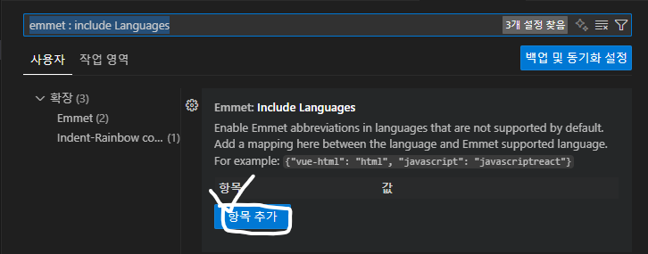

# 에러 발생

### - 타입스크립트 개발 환경에서 Emmet을 쓰는 과정에서 명령어가 사용되지 않음을 알았습니다.

# 에러 발생 이유

### - VSC 에디터의 설정 문제임을 확인했습니다.

# 에러 해결 방법

## - 첫번째

### 1. VSC 에디터 안에서 Command + Shift + p를 누릅니다. (윈도우 : control + shift + p)

### 2. Preferences: Open User Settings(JSON) 에 접근합니다.

### 3. 아래의 코드를 추가합니다.

```json

"emmet.inclueLanguages": {
  "javascript" : "javascriptreact",
  "typescript" : "typescriptreact"
},

```

## - 두번째

### 1. VSC 에디터 안에서 command + ,를 눌러 설정에 들어갑니다. (윈도우 : control + ,)

### 2. emmet : include Languages 검색합니다.

### 3. 항목 추가 버튼을 눌러 줍니다.



### 4. 각각의 키와 값에 아래의 값을 추가합니다.

```json

"javascript" : "javascriptreact",
"typescript" : "typescriptreact"

```

# div + tab이 div 태그가 아닌 다른게 자동 완성이 될 경우

### 1. command + ,

### 2. Editior : tab completion 검색

### 3. 해당 옵션을 "on"에서 "off" 또는 "onlySnippets"로 바꾸기
